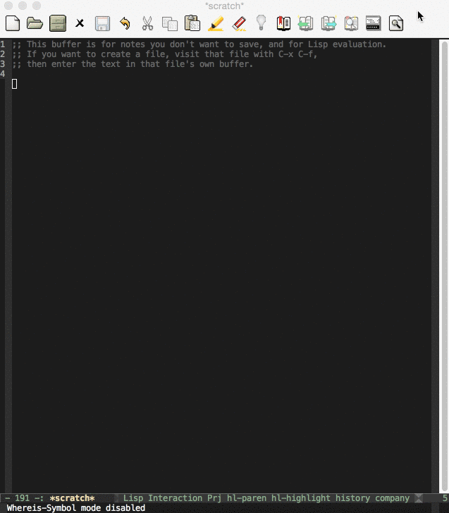
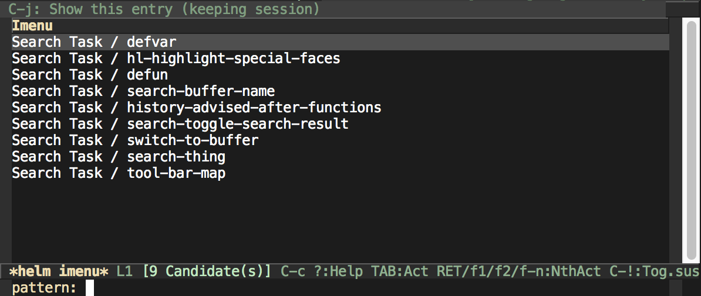
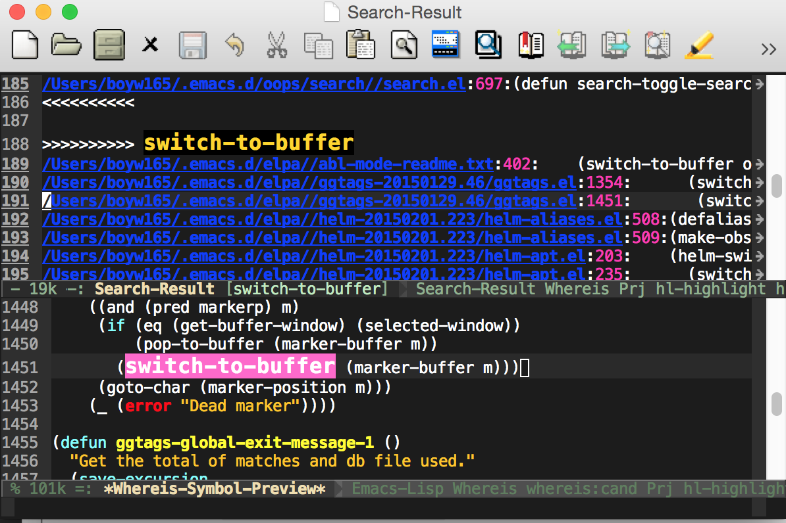

Queue The Search in Background, Make Search as Jotting and more
===============================================================

A search framework which let you search string or regular expression in the background and queue the search tasks. It uses `find`, `grep`, `ack` or `ag` command as its searching backends. In addition, the search result can be a jotting. So it keeps the search result for you and provides editing function.

The code is still young, feel free to give me adivces.

> Note: Support only on linux-liked environment.

Demo
----


Basic Usage - `search-thing`
----------------------------

Command **`search-thing`** takes **MATCH** string and optional **ATTRIBUTES** properties list, then creates a search task created by `search-backends`. 


There're 3 types of attributes:

* `:files` property name and a value of file-paths string list.
* `:dirs` property name and a value of directory-paths string list. The 1st element of the list is a **INCLUDES** string list. The 2nd element of the list is a **EXCLUDES** string list. The format of **INCLUDES** and **EXCLUDES** depends on the `search-backends` (Backend should describe the rule in its document).
* `:fromfile` property name and a value of file-path string.

Example:

* Search **MATCH** in specific files and directories:

```lisp
(search-thing MATCH :files '("/path/a" "/path/b") :dirs '(nil nil "/path/dir1" "/path/dir2"))
```
* Search **MATCH** in files listed in an input file (every file is seperated with '\n' line break character):

```lisp
(search-thing MATCH :fromfile "/path/inputfile")
```

* Search **MATCH** in specific directories but ignore subversion files (using default backend, `search-grep-backend`):

```lisp
(search-thing MATCH :dirs '(nil ("*.git*" "*.svn*") "/path/dir1" "/path/dir2"))
```

Advanced Usage - `search-thing-command`
---------------------------------------

Command **`search-thing-command`** takes **COMMAND** string (you have to provide it manually) and creates a search task.

Example:

* Create a search task using `find` and `grep` commands: 

```lisp
(search-thing-command "find /path/1 | xargs grep -nH -e MATCH 2>/dev/null")
```

Stop Running Tasks - `search-stop-all`
--------------------------------------

Command **`search-stop-all`** stops the running task and kills remaining search tasks.


Search Result
-------------

`self-insert-command` is disabled in the result buffer. But it provides following editing functions:

* `search-toggle-search-result` to toggle result buffer (show it when it's hidden; hide it when it's present).
* `search-result-delete-item-atpt` to delete unwanted results.
* Show outline with `imenu`.



* Work with `whereis-symbol-mode` **(will release at Jue)**.



TODO
----
* Improve interaction of `search-string` for file and directorty.
* Support AG backend.
* Support killing individual search task.

Contribution
------------
Forks and pull requests are welcome!
